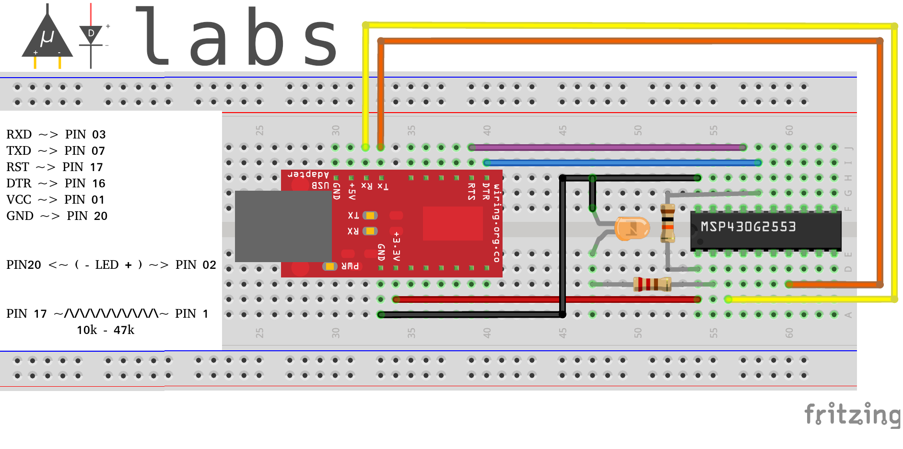

# Upside Down Labs msptool

[](https://github.com/upsidedownlabs/MSP430-Breadstick) 


The msptool is MSP430G2xx3 flashing tool supporting Linux &amp; Windows, it uses [mspdebug](https://github.com/dlbeer/mspdebug) in the background to provide a very simple interface to flash the MSP430G2xx3 using any generic USB-UART bridge. It should work with any MSP430G2xx3 series MCU with BSL support, USB-UART bridge can be something like CP2102/4, CH340, PL2303, and FT232R/B.

###### msptool usage:
```
[lorforlinux@dragon msptool]$ python msptool.py --help
usage: msptool.py [-h] -p PORT -f FIRMWARE

optional arguments:
  -h, --help            show this help message and exit
  -p PORT, --port PORT  USB-UART bridge port, Windows: COM#, Linux: /dev/tty#
  -f FIRMWARE, --firmware FIRMWARE
                        .txt(TI-TXT)/.elf/.hex/.bin format firmware image from
                        msp430-gcc/CCS/Energia
```


## MSP430G2553 + FT232RL


This repository contains a sample TI-TXT format firmware image for MSP430G2553 target acquired using CCS. Use the following command and hardware connection to blink the LED connected to P1.0 (Pin2) of the MSP430G2553.

###### Command:
``` 

# Linux
python msptool.py -p /dev/ttyUSB0 -f blinky.txt

# Windows
python msptool.py -p COM3 -f blinky.txt

Note: Make sure the port is correct before executing the command!

```
###### Circuit:


## License

#### Hardware
CERN Open Hardware License Version 2 - Strongly Reciprocal ([CERN-OHL-S-2.0](https://spdx.org/licenses/CERN-OHL-S-2.0.html)).

#### Software
MIT open source [license](http://opensource.org/licenses/MIT).

#### Documentation:
<a rel="license" href="http://creativecommons.org/licenses/by/4.0/"></a><br />This work is licensed under a <a rel="license" href="http://creativecommons.org/licenses/by/4.0/">Creative Commons Attribution 4.0 International License</a>.


